# Label Factory
#### Precise Digital Twin Alignment for Real-World Dataset Creation


 

## Table of Contents
1. [Overview](#overview)
2. [Features](#features)
3. [Installation](#installation)
4. [Usage](#usage)
5. [License](#license)
6. [Acknowledgements](#acknowledgements)

---

## Overview

This repository features a robot-assisted framework designed to generate annotated datasets. By aligning 3D object models with real images, it integrates synthetic and real-world data generation, enabling **semi-automatic annotation** with minimal human involvement. The framework enhances the **Blender Annotation Tool (BAT)** and **Robot Operating System 2 (ROS2)** to facilitate real-time image acquisition and annotation.

- [BAT](https://github.com/karolyartur/blender_annotation_tool)
- [ROS2](https://docs.ros.org/en/foxy/index.html)

### Key Contributions:
- **Scalable multi-modal annotation generation**: Automatically creates diverse annotations (instance segmentation, depth maps, surface normals) while maintaining physical realism and minimizing the synthetic-to-real domain gap.
- **Deterministic real-to-virtual alignment**: Employs geometric registration to ensure precise correspondence between real and virtual scenes, enabling reliable annotation projection.
- **Robot-assisted measurement infrastructure**: Combines robotic arm precision with calibrated cameras for accurate pose data and synchronized multi-view image capture.

## Features
- Real-to-virtual annotation generation using robot-assisted image acquisition.
- Pose estimation and annotation projection on real-world images.
- Scalable for large-scale dataset generation with varied annotation types.
- Supports object detection, 6D pose estimation, and other robotic perception tasks.

## Installation

Follow these steps to set up the environment and install dependencies:

### Blender Environment
- **Blender**: Requires Blender version 4.3.2 (or later). Download from [Blender's official website](https://download.blender.org/release/).
- **BAT**: Install the Blender Annotation Tool add-on from [BAT GitHub](https://github.com/karolyartur/blender_annotation_tool).

### ROS2 Environment
- **ROS2 Jazzy**: This framework requires ROS2 Jazzy. Follow the installation instructions at [ROS2 Jazzy Installation](https://docs.ros.org/en/jazzy/Installation.html).
- **MoveIt2**: Install MoveIt2 by following the [binary installation guide](https://moveit.ai/install-moveit2/binary).
- **UR Driver**: Install the [ROS2 Jazzy UR Driver](https://github.com/UniversalRobots/Universal_Robots_ROS2_Driver) for robot manipulation (tested with UR16e) and accurate camera extrinsic parameter identification, essential for the annotation pipeline.


### Repository
```bash
git clone https://github.com/ABC-iRobotics/Label_Factory.git
cd Label_Factory
colcon build
```

## Start the program
Add the following lines to the .bashrc file: 
```bash
source /opt/ros/jazzy/setup.bash
source install/setup.bash
```


### Start and setup the robot
Follow the setup of the robot presented (https://github.com/UniversalRobots/Universal_Robots_ROS2_Driver). \
Each of the following steps should be done in separated commandlines. \
Connect your USB camera(s) to the used PC.

#### Start the driver
```bash
# Replace ur5e with one of ur3, ur3e, ur5, ur5e, ur7e, ur10, ur10e, ur12e, ur16e, ur8long, ur15, ur18, ur20, ur30
# Replace the IP address with the IP address of your actual robot / URSim
ros2 launch ur_robot_driver ur_control.launch.py ur_type:=ur5e robot_ip:=192.168.1.1
```

#### Start MoveIt2
```bash
# Replace ur5e with one of ur3, ur3e, ur5, ur5e, ur7e, ur10, ur10e, ur12e, ur16e, ur8long, ur15, ur18, ur20, ur30
ros2 launch ur_moveit_config ur_moveit.launch.py ur_type:=ur5e launch_rviz:=true
```

#### Start end-effector publisher
```bash
ros2 run label_factory ee_pose
```

### Setup the config file
```bash
cd label_factory
nano config.yaml
```
Fill the confing file
```yaml
# Example

# ids of the USB cameras (int)
camera_indexes:
    - 6 

# sensor width of the choosen cameras (int)
sensor_width_6: 4.233

# orientation of the cameras relative to the flange in euler angles (deg) (list of list)
flange_camera_orientation: 
- - 0
  - 0
  - 0

# position of the cameras relative to the flange in euler angles (deg) (list of list)
flange_camera_translation: # 
- - 0
  - 0
  - 0

#  Names of the moveit frames
moveit_configs:
    base_link_name: base_link
    end_effector_name: tool0
    move_group_arm: ur_manipulator

# Path to the generated charuco board, and the render images
path_and_name_of_the_charuco_image: <your path to the generated Charuco board>
path_to_rendered_img: <your path to the generated renders>
```

#### (Optional) Create ChArUco board image 
The created ChArUco board is created at the path you add in the config.yaml
```bash
export PYTHONPATH=".LF_venv/lib/python3.12/site-packages:$PYTHONPATH"
ros2 run label_factory ChArUco
```
#### Start the User Interface
```bash
./run.sh
```

## Usage
The following image shows the User Interface:

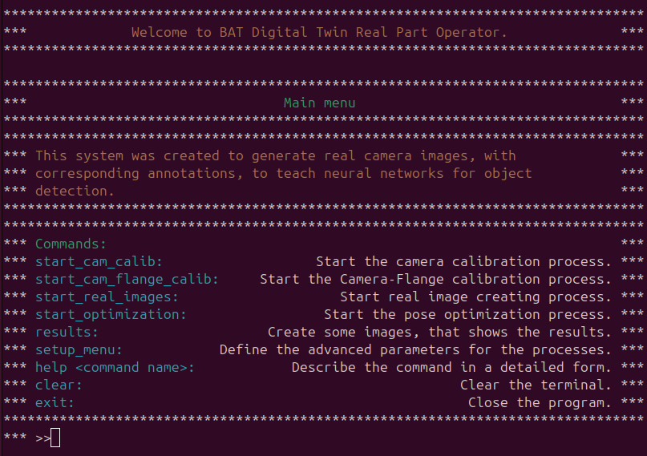

Here the User can start the different calibration processes (start_...). 
Also under the setup menu the different parameters for the calibration can be changed. 

##### Calibration steps
- 1, Place the ChArUco board under the camera FoV \
- 2, Enter: start_cam_calib 
- 3, Enter: start_cam_flange_calib
- 4, Enter: start_real_images
- 5, Open the Blender scene
- 6, Define the object name in the setup menu (Same name as in the Blender scene)
- 7, Enter: start_optimization 
    - Define 3D points on the mesh (az least 4)
        - Left click: Add point
        - Right click: Delete last point
    - Define the corresponding points on the real image
        - Left click: Add point
        - Right click: Delete last point
        - Middle click: Skip a point (use if the feature point is hidden on the 2D image)
    - Press Next to get next calibration image


- 8, Enter: results
- 9, Repeate steps 6-8

## Example results
:-------------------------:|:-------------------------:|:-------------------------:
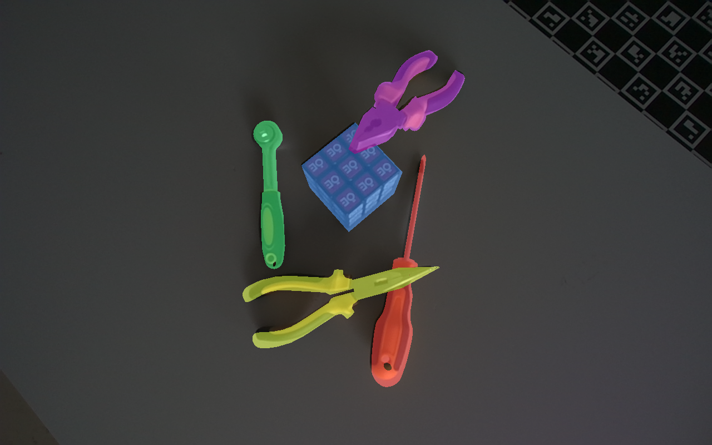  |   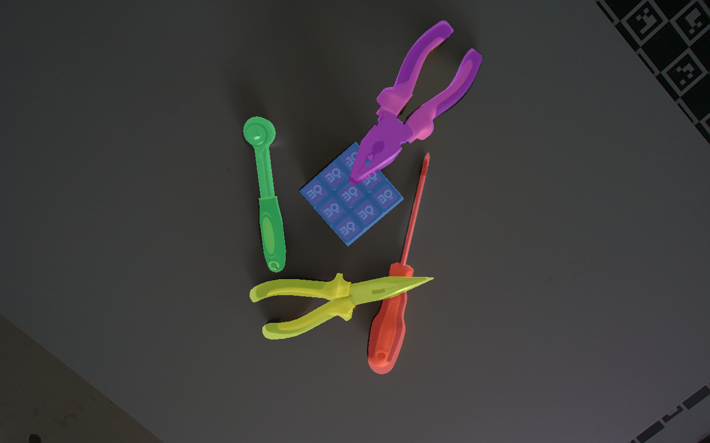    |   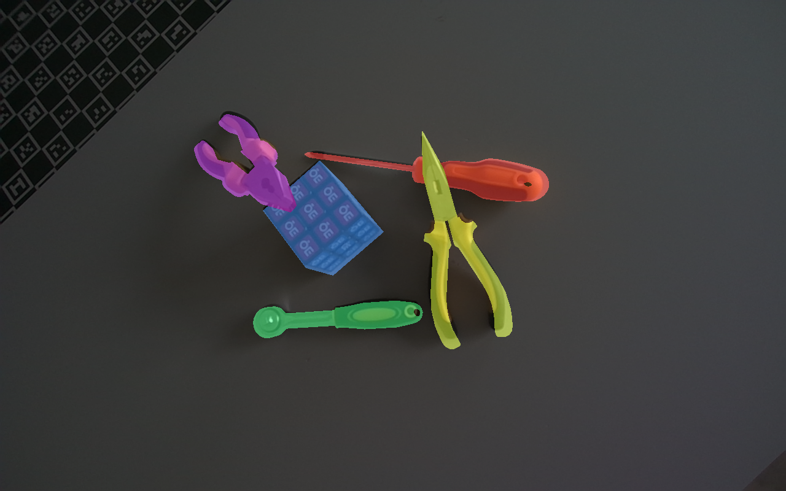 
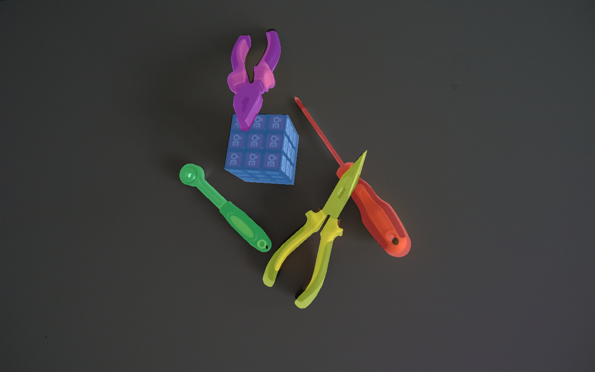  |   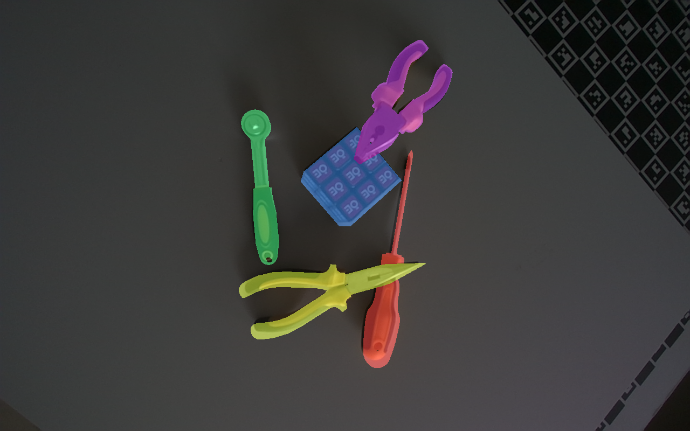    |   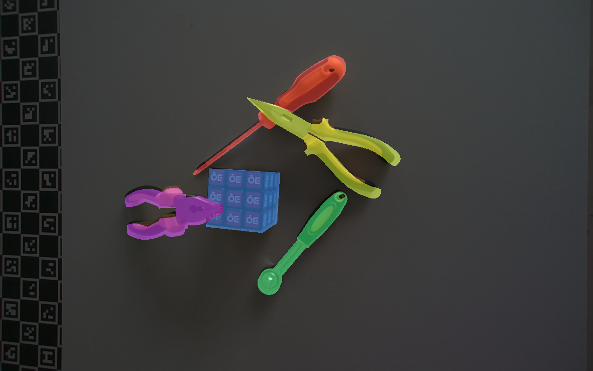
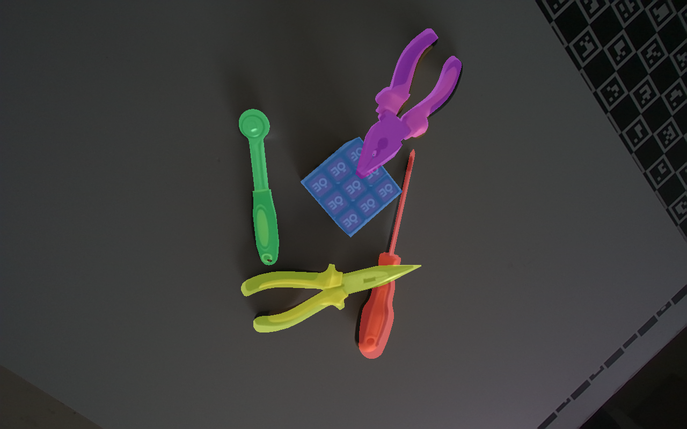  |   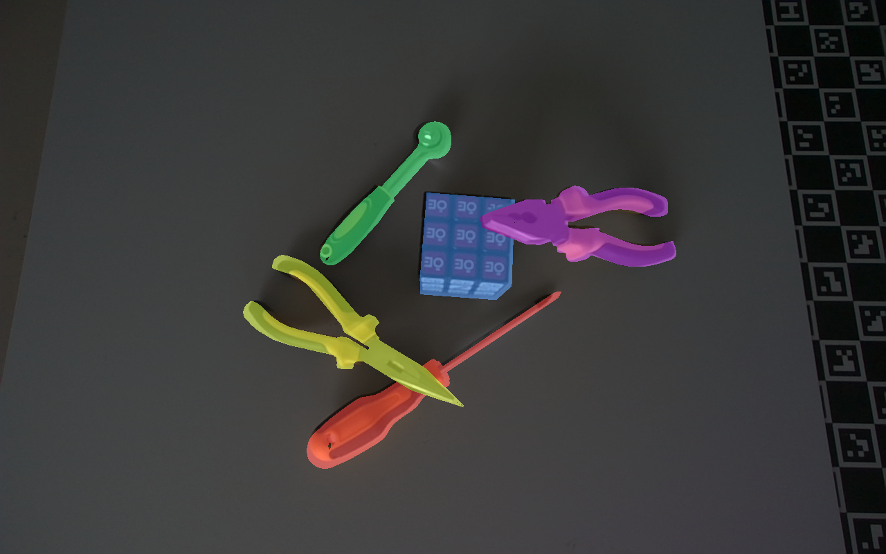    |   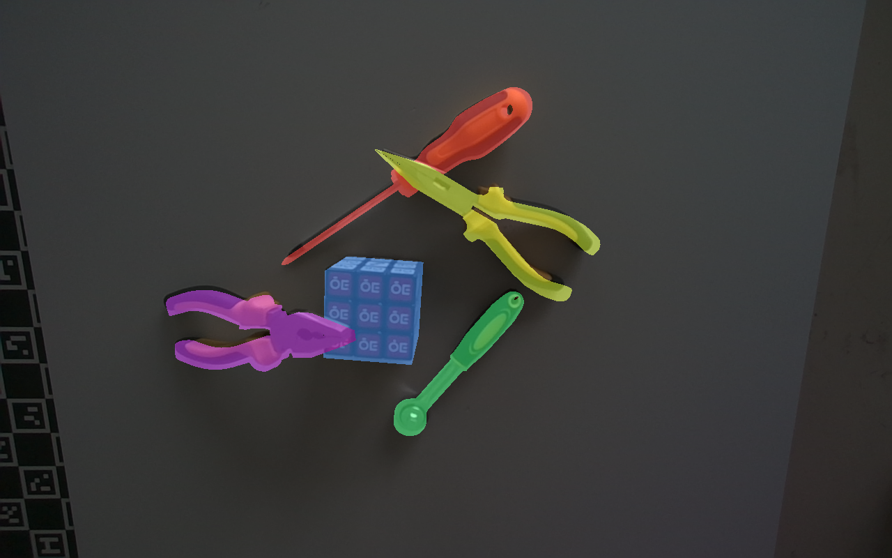
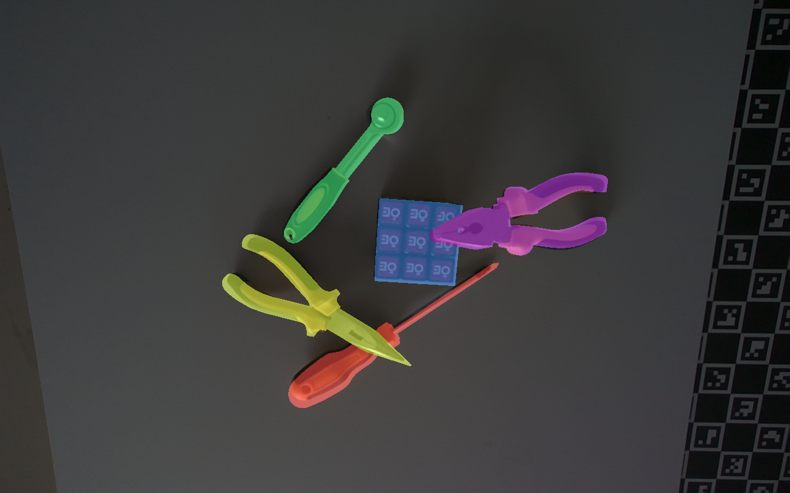  |   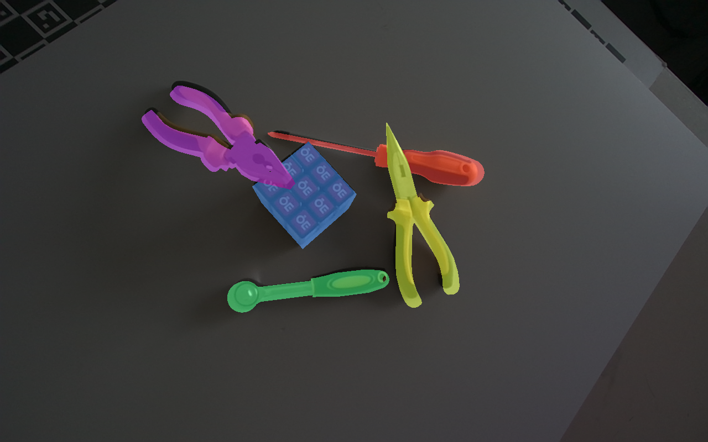    |   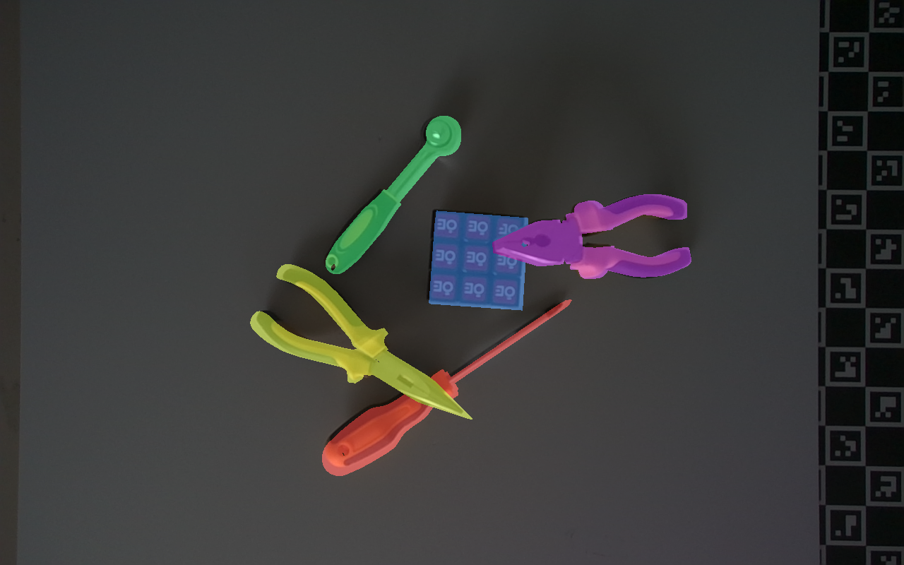 
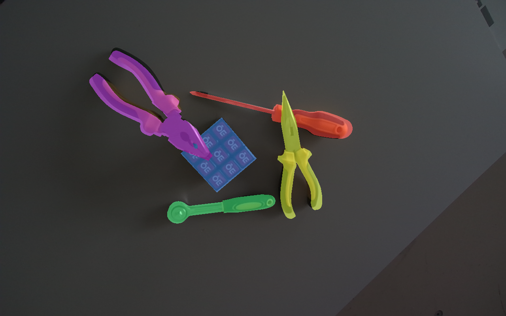  |   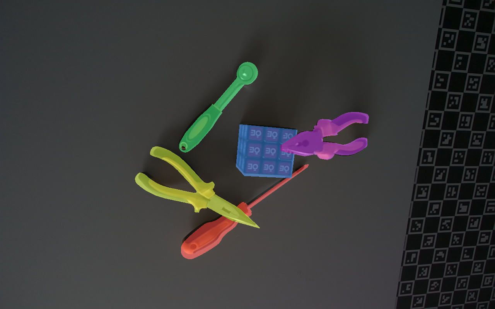    |   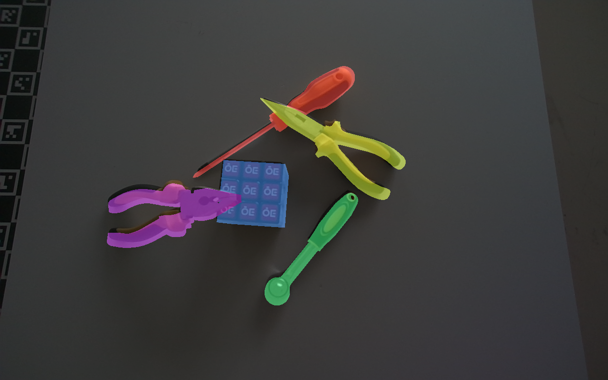 

## License

This software is released under the MIT License, see [LICENSE](./LICENSE).   

## Acknowledgement
This work is related to the MedLaBotX project (2024-1.2.3-HU-RIZONT-00069).
Project 2024-1.2.3-HU-RIZONT-00069 has been implemented with support provided by the Ministry of Culture and Innovation of Hungary from the National Research, Development, and Innovation Fund, financed under the 2024-1.2.3-HU-RIZONT funding scheme.
4-1.2.3-HU-RIZONT funding scheme.

